import Tabs from '@theme/Tabs';
import TabItem from '@theme/TabItem';

# Flash Canonical Ubuntu 24.04 using Qualcomm Launcher
 
	Qualcomm® Launcher is a user-friendly, GUI-based tool designed to simplify the process of downloading and flashing operating systems onto Qualcomm®-based development kits. This section provides step-by-step guidance to flash the **Renesas USB firmware** and replace the existing OS with a **certified Canonical Ubuntu 24.04 server** image.  
	
	**User steps**:  

	#### 1️⃣ Install Qualcomm Launcher
	1. Visit QSC web portal: **https://softwarecenter.qualcomm.com/catalog/item/Qualcomm_Launcher**    
	2. Select the appropriate **OS type** and **architecture** based on your host machine.  
	3. Choose the latest version and click Download to get the installer.   

	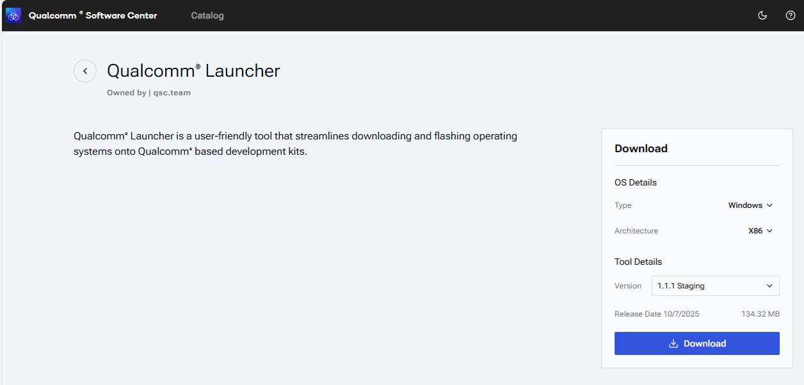  

	4. Navigate to your download folder and run the installer: "Qualcomm_Launcher.x.x.x.Windows-AnyCPU.exe".  
	5. Once installed successfully, you will see the **Qualcomm Launcher** application interface.  

	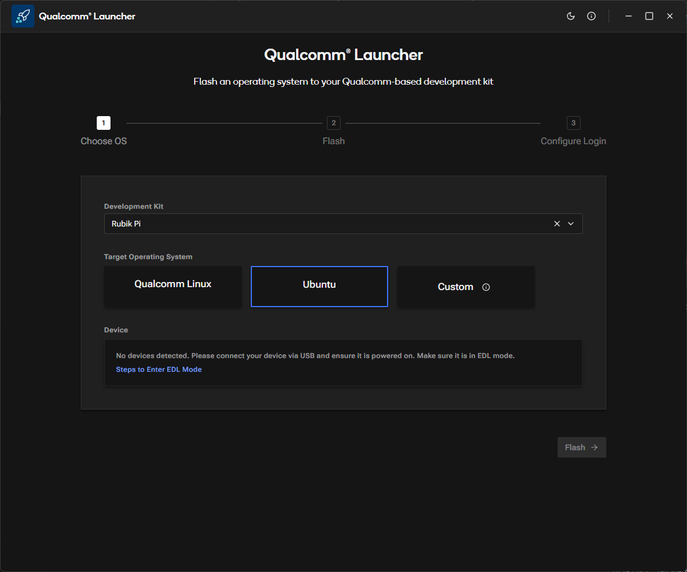  
	
	#### 2️⃣ Flashing Operations  
	1. In the Launcher, select the **Development Kit** as Rubik Pi and the **Target Operating System** as Ubuntu.  
	2. Put the device into EDL mode (instructions are available within the app). Once in EDL mode, the Rubik Pi 3 device will be detected.  

	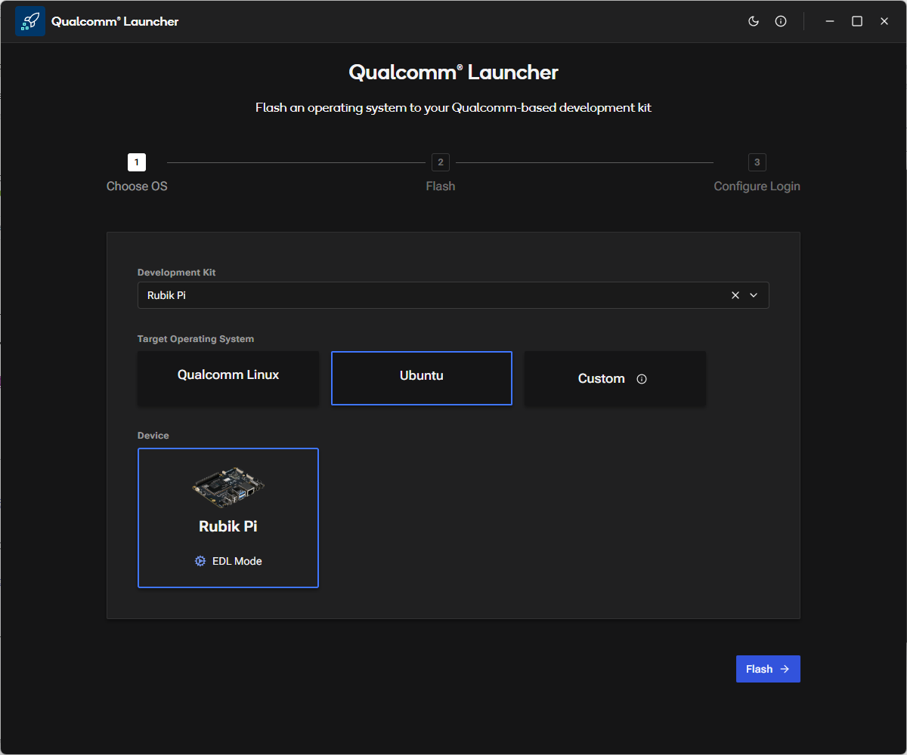 
	3. Click Flash button to begin updating the Renesas USB firmware.    
	4. A progress screen will display the status of the USB firmware flashing process.  

	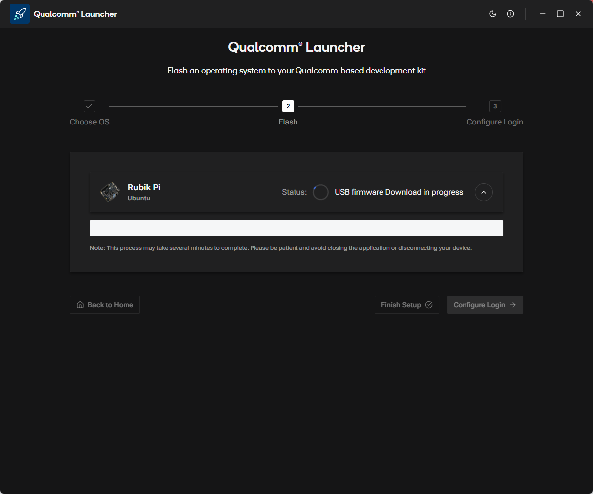 

	5. After successful USB firmware flashing, the following confirmation screen will appear.  
	:::note
	In the log message section, you can observe the platform image being downloaded and the flash build being constructed in the background.
	:::
	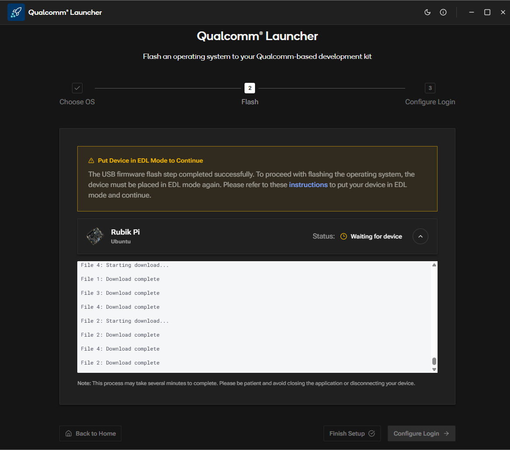 
	6. Once the installer is waiting for user action to put the device into EDL mode, you will see the following screen.  

	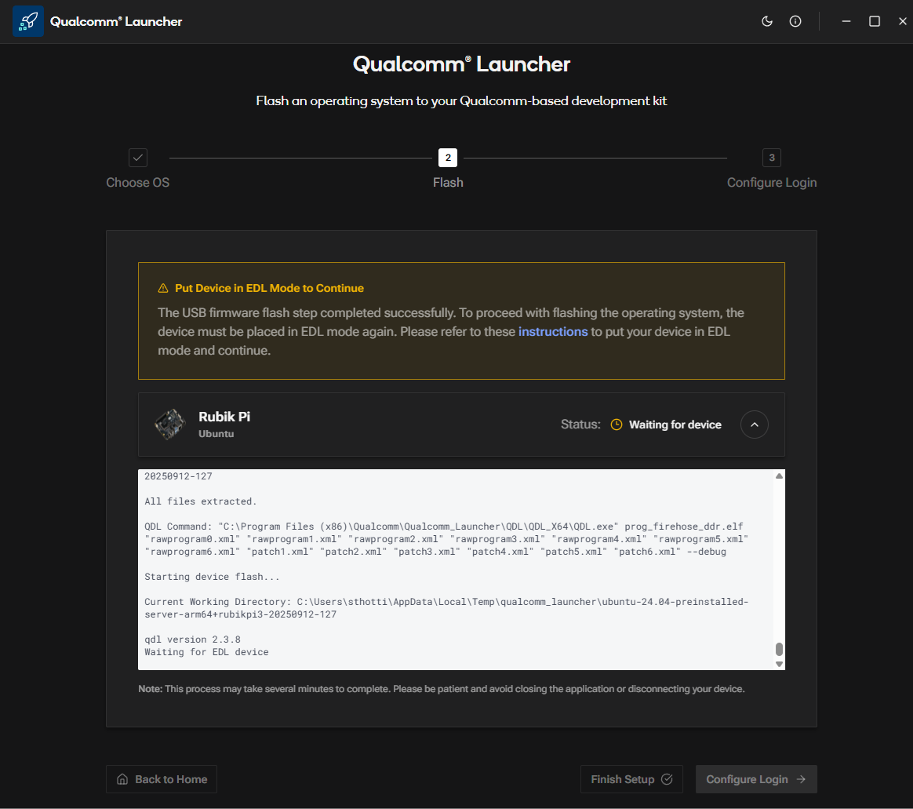 

	7. As soon as the device is placed into EDL mode, the flashing operation begins automatically. You will then see the following screen.

	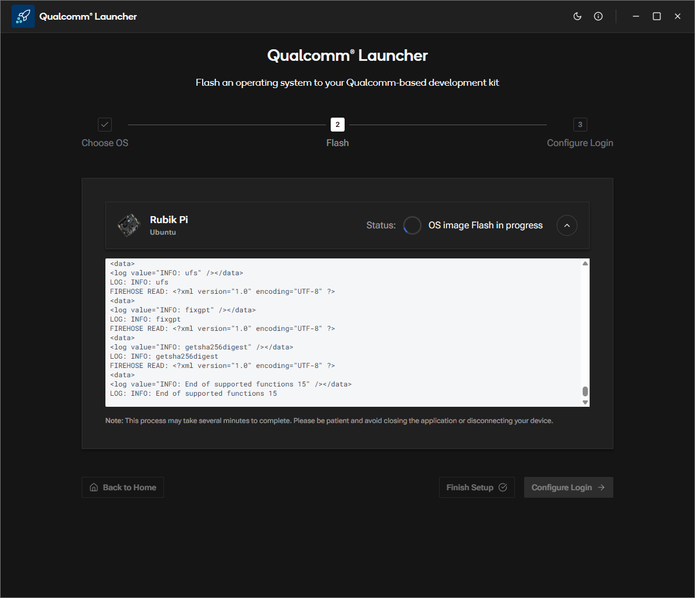 

	8. After the OS image is successfully flashed, the following confirmation screen will appear.

	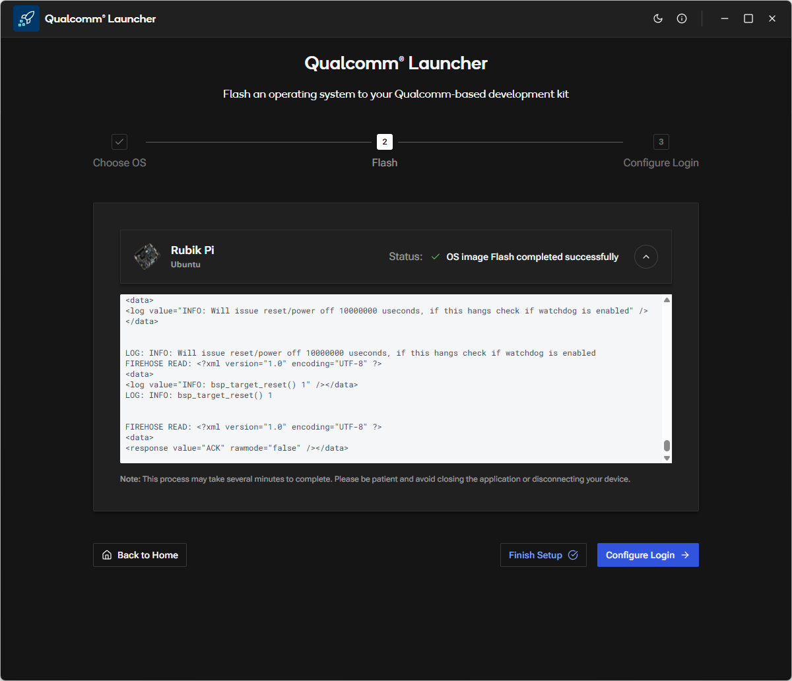 
	
	#### 3️⃣ Configure the device
	1. After the OS image flashing is complete, the launcher will reboot Rubik Pi 3 device into the newly installed operating system. You can now proceed to configure the device.
	2. Click Configure Login, and the following screen will be displayed.

	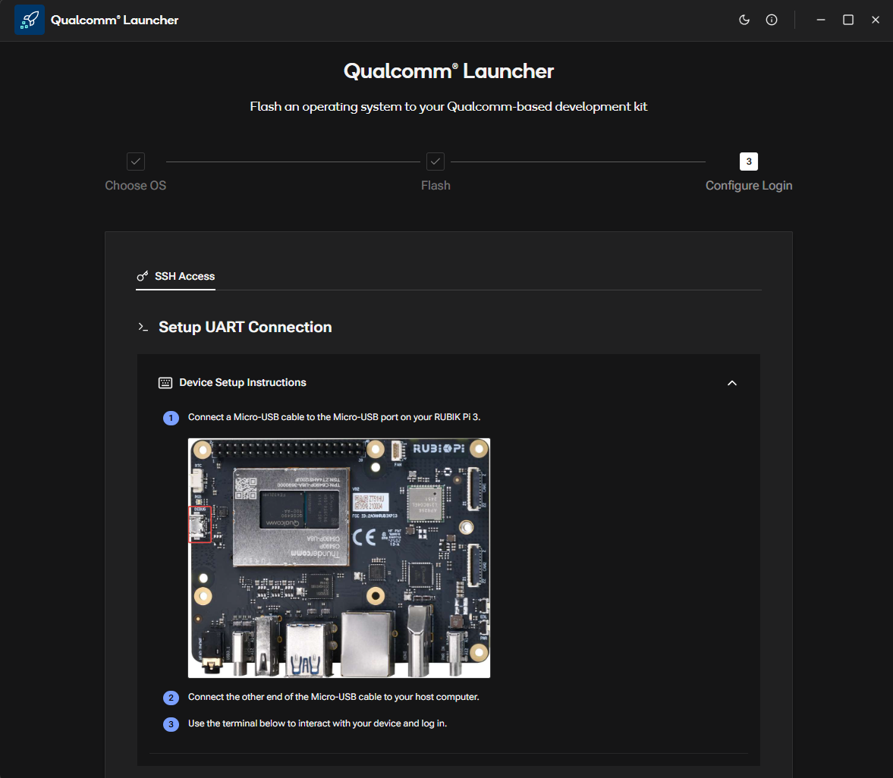 
	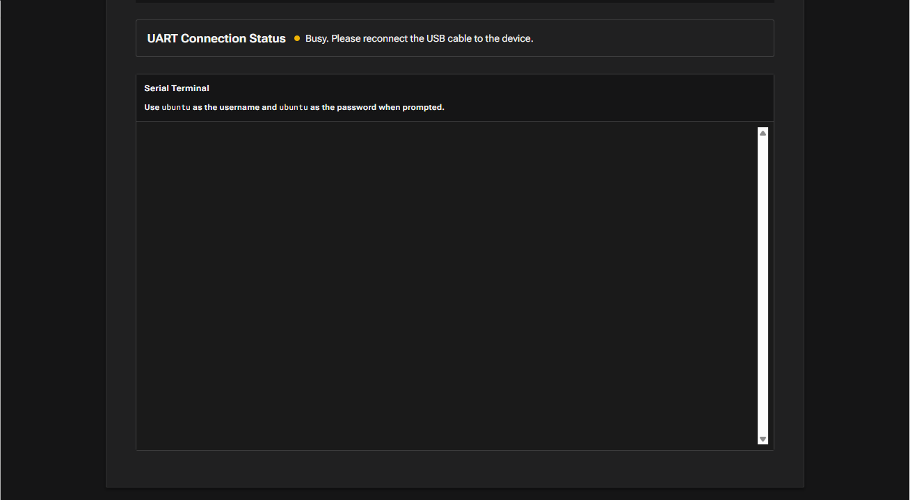 
	:::note
	If the MicroUSB COM port on the host system is currently in use by another tool (e.g., **PuTTY, Tera Term**), please close it before proceeding.
	:::
	3. Once the Micro-USB cable is connected (as shown in the screen above), the launcher will prompt you to configure the Wi-Fi.

	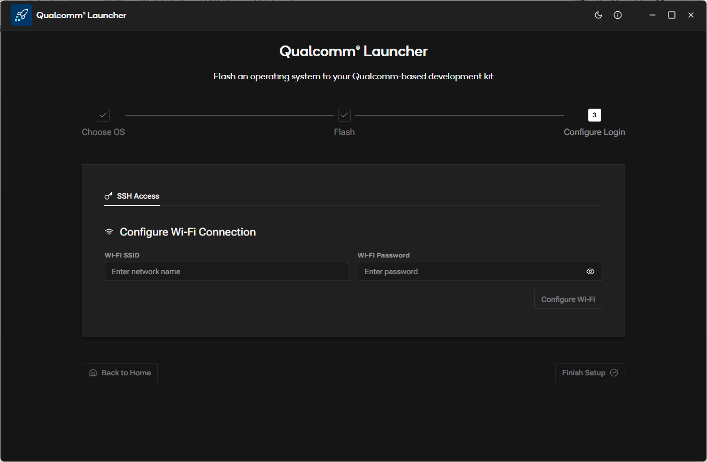
	4. Configure the Wi-Fi by entering the SSID and password.

	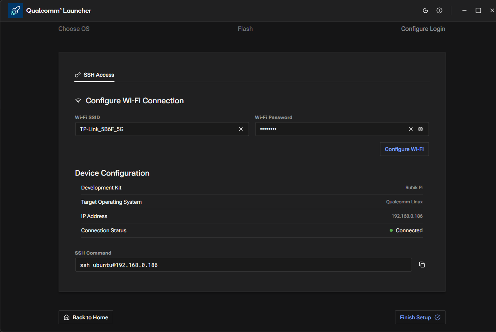
	5. Click Finish Setup and verify that the following screen appears.
	
	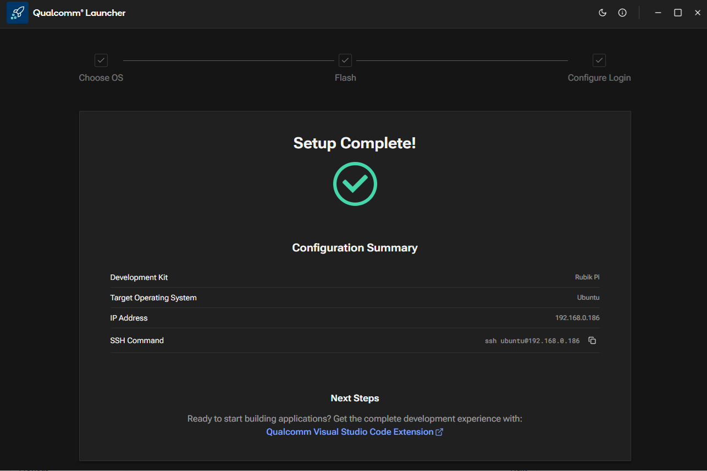

> After the image is flashed, refer to the [**Application Development and Execution Guide**](https://hongyang-rp.github.io/rubikpi-ubuntu-user-manual-test-en.github.io/docs/Document%20Home/Application%20Development%20and%20Execution%20Guide/#-application-development--execution-flow-summary).  